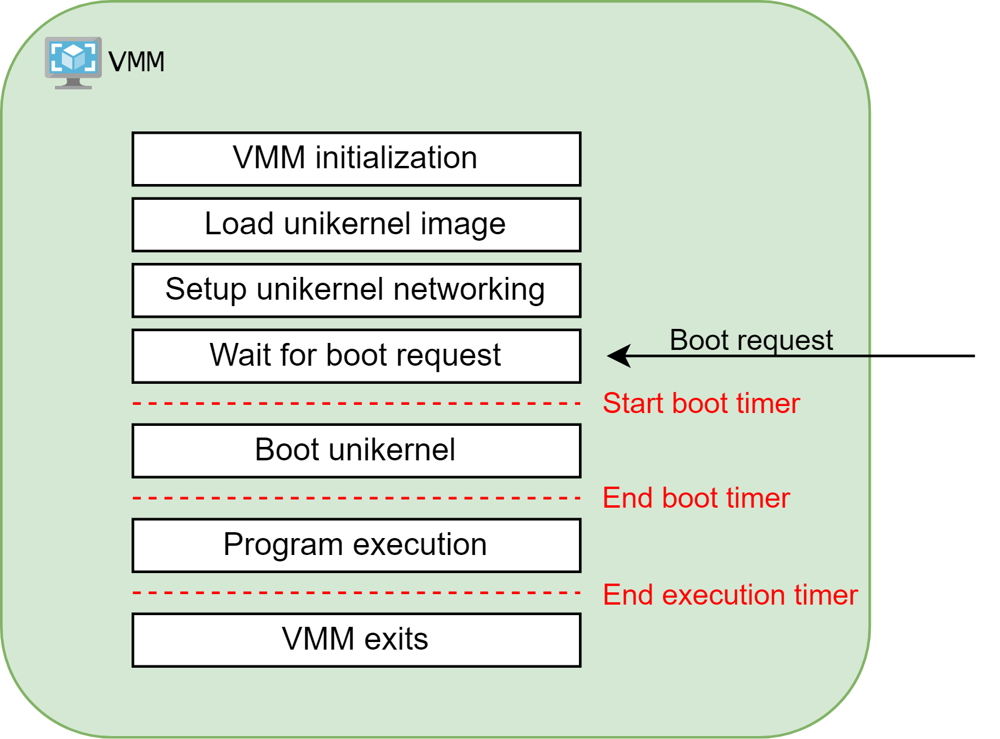

# benchmark-tool

## Performance Benchmark

### Getting started

Prerequisites:
  - Docker
  - Go compiler (preferred version 1.20 or higher)

To build the performance benchmark application, run the following command:
    
```bash
$ go build 
```

To run the performance benchmark application, run the following command:

```bash
$ ./benchmark-tool performance
INFO[2023-07-05 17:00:32] Running benchmark for [unikernel_name] with [vmm_name] backend 
INFO[2023-07-05 17:00:35] Unikernel booted, waiting for execution to end... 
INFO[2023-07-05 17:00:44] Time to run: 1234ms         
INFO[2023-07-05 17:00:44] Time to boot: 123ms         
INFO[2023-07-05 17:00:44] Image size: 1.23MiB         
INFO[2023-07-05 17:00:44] Total memory usage: 123.45MiB 
```

First time when the build is done, the application will download the required Docker images for each supported unikernel and VMM combination. This process can take a while, depending on the speed of your internet connection. If you want to see logs for this process, add `--debug` flag to the command.

As the build process is done inside a docker image, subsequent builds will be much faster due to Docker layer caching.

### Implementation details

#### Multiple Unikernel Support

The performance benchmark application has the capability to report metrics for unikernel projects running on various VMM backends, provided that support for them has been added to the application. The upcoming paragraphs will outline the chosen modular approach that simplifies the process of incorporating support for new unikernels or VMM backends.

There are two places which need to be modified in order to add a new unikernel project or modify an existing one:
  - the `SupportedUnikernels` structure inside `cli/performance/supported.go` file
  - the directory structure inside the `unikernels` directory

The `SupportedUnikernels` structure keeps track of which unikernels are supported based on their GitHub repository name. Each repository name refers a `SupportedUnikernel` structure that contains a unikernel name and a list of supported VMMs.

```go
type SupportedUnikernel struct {
    UnikernelName string,
    SupportedVMMs []string,
}

var SupportedUnikernels = map[string]SupportedUnikernel {
	"cloudius-systems/osv": {
        UnikernelName: "osv"
        SupportedVMMs: []string{"qemu", "firecracker"}
    },
	"unikraft/unikraft": {
        UnikernelName: "unikraft"
        SupportedVMMs: []string{"qemu"}
    },
}
```

The unikernel name and the list of supported VMMs described in the `SupportedUnikernels` structure are used inside the `unikernels` folder structure. Each unikernel must have a folder which contains subdirectories with each supported VMM name. Inside each subdirectory there must be a `[unikernel name].Dockerfile` file that describes how the unikernel is built and run.

```
unikernels
├── [unikernel name]
│   ├── [vmm name]
│   │   └── [unikernel name].Dockerfile
│   └── [vmm name]
│       └── [unikernel name].Dockerfile
└── [unikernel name]
    └── ...
```

There can be other files in those subdirectories as long as the main structure remains unchanged. For example, we chose to use a Python script that resides alongside each `Dockerfile`.

#### Precise Boot Time Measurement

To obtain precise measurements of the boot time for a unikernel solution, our aim was to exclude the time taken by the underlying VMM to initiate its internal processes.

Each VMM has its own distinct process for starting the virtual machine. Thankfully, both Firecracker and QEMU offer the capability to load an image in advance and initiate the boot process at a later point. This advantageous feature allows us to initiate the VMM process, allow it to load its internal components, load the unikernel image, and subsequently commence the booting process while simultaneously capturing the boot time measurement.



In the initial stages of our research, we took a straightforward approach by initiating the VMM process independently and commencing the boot timer. During our investigation, we discovered that one of the supported unikernels, OSv, reported significantly lower boot times when compared to our own measurements, with a discrepancy of approximately 200-300 ms. This disparity prompted us to explore a more refined and precise measurement technique, which involved a sequential boot process where the VMM was launched first, followed by remote commands to initiate the booting of the virtual machine.


##### QEMU

For QEMU, we utilized the QEMU Machine Protocol (QMP), a JSON-based communication protocol that enables applications to exert control over a QEMU instance. To initiate the QEMU instance with QMP support, the following argument is required:

```-qmp unix:QMP_SOCKET,server=on,wait=on```

Once the QEMU process is launched, establishing a QMP connection to the corresponding socket allows us to initiate the boot process seamlessly.

##### Firecracker

For Firecracker, we made use of its dedicated REST API. By providing the `--api-sock` argument, Firecracker initiates the REST API server and remains in a waiting state, ready to process PUT requests for configuring and booting the virtual machine.

```python
# Set boot source
api.make_put_call(
    "/boot-source",
    {
        "kernel_image_path": "/osv/build/last/loader-stripped.elf",
        "boot_args": "--nopci /benchmark_executable",
    },
)

# Start the booting process
api.make_put_call("/actions", {"action_type": "InstanceStart"})
```

#### Memory Measurement

To measure memory consumption, we opted to measure the total memory occupied by both the VMM and the unikernel. This decision was made due to the lack of a straightforward and universal method to determine which memory pages are utilized by the VMM and which are utilized by the unikernel. Consequently, it was not possible to accurately determine the standalone memory consumption of the unikernel.

To monitor the memory usage of a process, we developed a Python class that tracks the RSS memory of a given process ID and records the measurements at regular intervals. The memory readings are stored in a list for further analysis and reference.

```python
class MemoryMonitor(object):
    def __init__(self, waiting_process, pid, update_interval) -> None:
        self._rss_list = []
        self._process = waiting_process
        self._update_interval = update_interval
        self._pid = pid

    def get_rss(self) -> List[int]:
        return self._rss_list

    def run(self) -> None:
        # Loop until the process exits
        while True:
            try:
                # Wait for the process exit or the interval to expire 
                self._process.wait(self._update_interval)
                break
            except KeyboardInterrupt:
                # If a CTRL + C was capured, close the program
                os.kill(self._pid, signal.SIGINT)
            except subprocess.TimeoutExpired:
                # If the time interval expired, compute process RSS
                pmap = subprocess.run(
                    ["pmap", "-x", str(self._pid)],
                    text=True,
                    stdout=subprocess.PIPE,
                )
                line = pmap.stdout.splitlines()[-1]
                rss = int(line.split()[3])
                self._rss_list.append(rss)
```

## Community Benchmark

### Getting started

Prerequisites:
  - A GitHub [Personal Access Token](https://github.com/settings/tokens)
  - Go compiler (preferred version 1.20 or higher)

To build the community benchmark application, run the following command:
    
```bash
$ go build 
```

To run the community benchmark application, run the following command:

```bash
$ export GITHUB_TOKEN=[your_personal_access_token]
$ ./benchmark-tool community [repository_link] [repository_link] [repository_link]...
```

Example: 

```bash
$ export GITHUB_TOKEN=[your_personal_access_token]
$ ./benchmark-tool community https://github.com/cloudius-systems/osv
INFO[2023-07-05 16:31:27] Collecting community data for https://github.com/cloudius-systems/osv
{
        "owner": "cloudius-systems",
        "repo": "osv",
        "star_number": 3910,
        "fork_number": 604,
        "pull_requests_info": {
                "open_pull_request_number": 4,
                "closed_pull_request_number": 78,
                "average_comments_per_pull_request": 2.1219512195121952,
                "average_commits_per_pull_request": 2.3048780487804876
        },
        "issues_info": {
                "open_issues_number": 324,
                "closed_issues_number": 825,
                "average_comments_per_issue": 3.1270670147954744
        },
        "community_documentation": null,
        "collected_on": "2023-07-05T16:31:50.552930353+03:00"
}
```

### Implementation details

#### GitHub API

The GitHub GraphQL API is used to collect the community metrics for a given repository. The following metrics are collected:
  - Number of stars
  - Number of forks
  - Number of open and closed pull requests
  - Number of open and closed issues
  - Average number of comments per pull request
  - Average number of commits per pull request
  - Average number of comments per issue